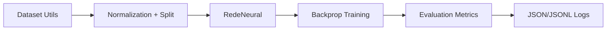

# rede-neural-do-zero

[](https://github.com/SavioCodes/rede-neural-do-zero/actions/workflows/ci.yml)
[](./LICENSE)
[](https://www.python.org/)

Educational neural network implementation from scratch with a reproducible evaluation pipeline.

PT-BR: Implementacao didatica com foco em reproducibilidade e qualidade de engenharia.

## Why This Exists

This repository was created to understand core neural network mechanics without high-level frameworks.
It includes training logic, utility modules, tests, and evaluation scripts.

## Architecture



## Tech Stack

- Python 3.8+
- NumPy, pandas, matplotlib
- pytest for tests

## Repository Structure

```text
src/         # Neural network implementation and helpers
tests/       # Unit and integration tests
examples/    # Usage examples
docs/        # Theory and algorithm notes
scripts/     # Reproducible evaluation scripts
logs/        # Evaluation logs (tracked with .gitkeep)
```

## Quickstart

```bash
python -m venv .venv
pip install -r requirements.txt
pytest -q
```

## Reproducible Evaluation

```bash
python scripts/evaluate.py --seed 42 --epochs 500 --samples 300
```

The script writes:

- `logs/eval-summary.json`
- `logs/eval-history.jsonl`

## Test and Quality Gates

```bash
pytest -q
python scripts/evaluate.py --seed 42 --epochs 400 --samples 240
```

## Operational Signals

- The repo uses deterministic evaluation to keep results comparable and reduce CI noise.
- Theory notes, scripts, and generated logs are tracked as part of the engineering story, not split from the implementation.
- The experiment loop is reproducible from the terminal, producing JSON and JSONL artifacts from a fixed-seed run.

```bash
pytest -q
python scripts/evaluate.py --seed 42 --epochs 400 --samples 240
```

## Technical Decisions and Trade-offs

- Framework-free implementation improves learning depth at the cost of production features.
- Deterministic evaluation (fixed seed) reduces CI flakiness.
- JSON/JSONL logs are lightweight and portable for future experiment tracking.

## Roadmap

- [ ] Add richer experiment configurations (learning-rate sweeps)
- [ ] Add confusion-matrix plot export in CI artifacts
- [ ] Add notebook-free benchmark report generation

## License

MIT. See [LICENSE](./LICENSE).

PT-BR: Este projeto continua sendo um material educacional aberto para estudo de redes neurais artificiais.
